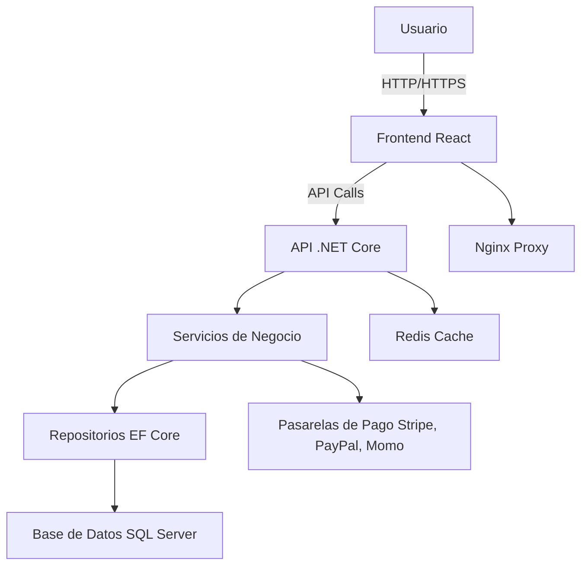
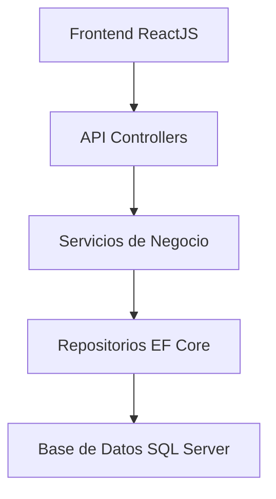
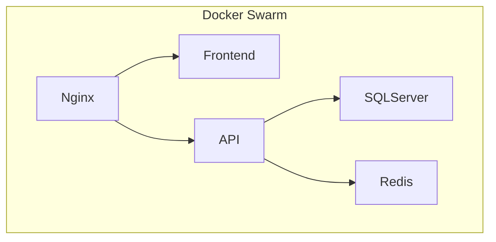
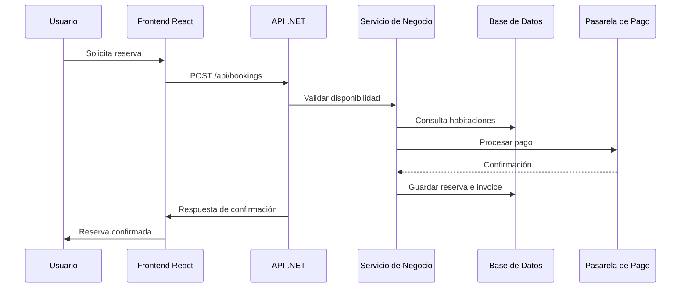

# Arquitectura del Proyecto RestHotel

Repositorio: [https://github.com/vhtnguyen/RestHotel](https://github.com/vhtnguyen/RestHotel)

## 1. Descripción General

**RestHotel** es una aplicación completa para la gestión de reservas hoteleras. Está diseñada con una arquitectura de tres capas, utilizando .NET Core 7 para el backend y ReactJS para el frontend. El sistema está conteinerizado con Docker y utiliza servicios como Redis, SQL Server y Nginx para su infraestructura.

---

## 2. Arquitectura General

El sistema se estructura bajo una **arquitectura en tres capas**:

* **Capa de Presentación**: Interfaz de usuario desarrollada con ReactJS.
* **Capa de Lógica de Negocio**: Web API desarrollada con ASP .NET Core.
* **Capa de Acceso a Datos**: Implementada con Entity Framework Core sobre SQL Server.

Adicionalmente, se apoya en servicios auxiliares como Redis y Nginx, y está preparado para ejecutarse en contenedores Docker coordinados con Docker Swarm.

---

## 3. Capa de Presentación (Frontend)

* **Tecnologías**: ReactJS, Bootstrap 4, jQuery
* **Características**:

  * SPA (Single Page Application)
  * Formularios de login, registro, creación de reservas, facturación y gestión de habitaciones.
  * Llamadas a la API mediante `fetch` o `axios`.
  * Manejo de estado usando React Context o hooks.

---

## 4. Capa de Lógica de Negocio (Backend)

* **Tecnología principal**: ASP .NET Core 7 Web API

### Proyectos principales:

* `RestHotel.API`: Contiene los controladores y configuración de la API.
* `RestHotel.Core`: Define las entidades de dominio, interfaces de servicios y DTOs.
* `RestHotel.Services`: Implementa la lógica de negocio.

### Responsabilidades:

* Autenticación y autorización
* Validaciones de negocio (fechas de reservas, disponibilidad, precios)
* Coordinación de pagos mediante gateways externos

---

## 5. Capa de Acceso a Datos

* **ORM**: Entity Framework Core
* **Base de Datos**: SQL Server
* **Patrones aplicados**:

  * Repositorio genérico
  * Unit of Work

### Características:

* Repositorios para cada entidad principal (`RoomRepository`, `BookingRepository`, etc.)
* Migrations gestionadas por EF Core
* Configuración desde `appsettings.json` o variables de entorno

---

## 6. Infraestructura y Despliegue

* **Contenedores Docker**:

  * API Backend
  * Frontend React (estático)
  * Base de datos SQL Server
  * Redis (cache y gestión de sesiones)
  * Nginx (reverse proxy)

* **Orquestador**: Docker Swarm

* **CI/CD**: Uso de GitHub Actions (esbozado) para builds y tests

---

## 7. Servicios e Integraciones

* **Pasarelas de pago**: Stripe, PayPal, Momo
* **Sistema de cache**: Redis
* **Proxy**: Nginx
* **Futuras integraciones**: Email, SMS, analítica

---

## 8. Flujo de una Petición de Reserva

1. Usuario accede a la interfaz y solicita una reserva.
2. ReactJS envía la solicitud al endpoint de reservas.
3. API valida los datos y verifica disponibilidad con el repositorio.
4. Se realiza el pago mediante el gateway correspondiente.
5. Si es exitoso, se persisten las entidades `Booking` e `Invoice`.
6. Se responde con una confirmación de reserva.

---

## 9. Principios y Buenas Prácticas

* Separación de responsabilidades por capa
* Uso de interfaces para inyección de dependencias
* DTOs para proteger el modelo de dominio
* Reutilización de componentes de frontend
* Configuración externalizada

---

## 10. Conclusión

RestHotel está diseñado para ser escalable, modular y fácil de mantener. Su arquitectura lo hace ideal para hoteles pequeños o medianos que desean digitalizar su sistema de reservas con tecnología moderna, integración a pagos y despliegue eficiente sobre infraestructura contenerizada.

## Diagramas de Arquitectura

### Diagrama General de Arquitectura

---

### Arquitectura en Capas

---

### Componentes de Docker

---

### Flujo de Reserva de Habitaciones

---
